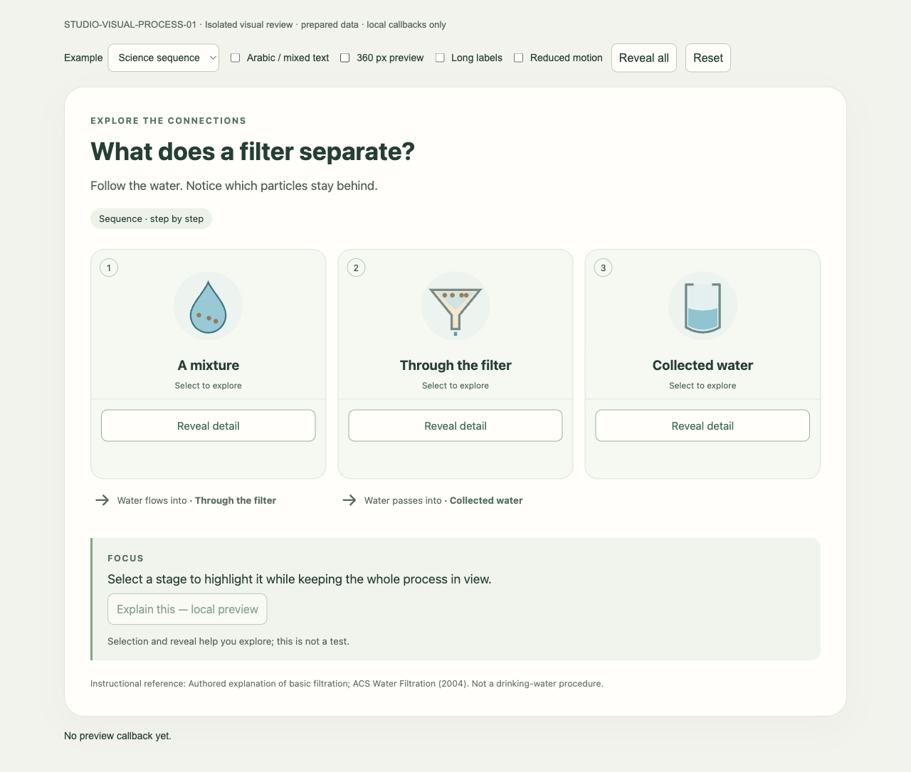
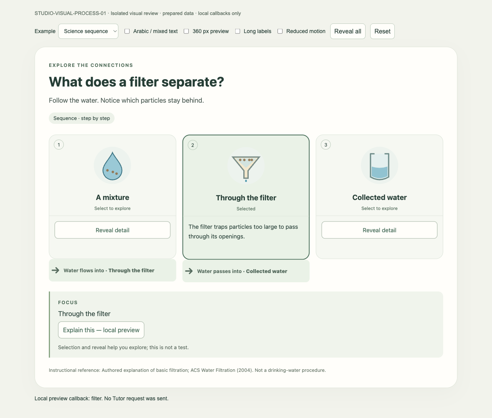
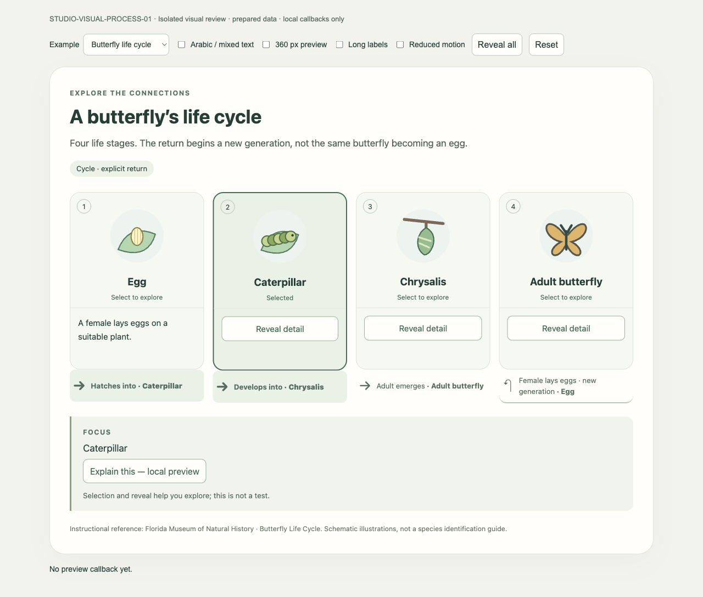
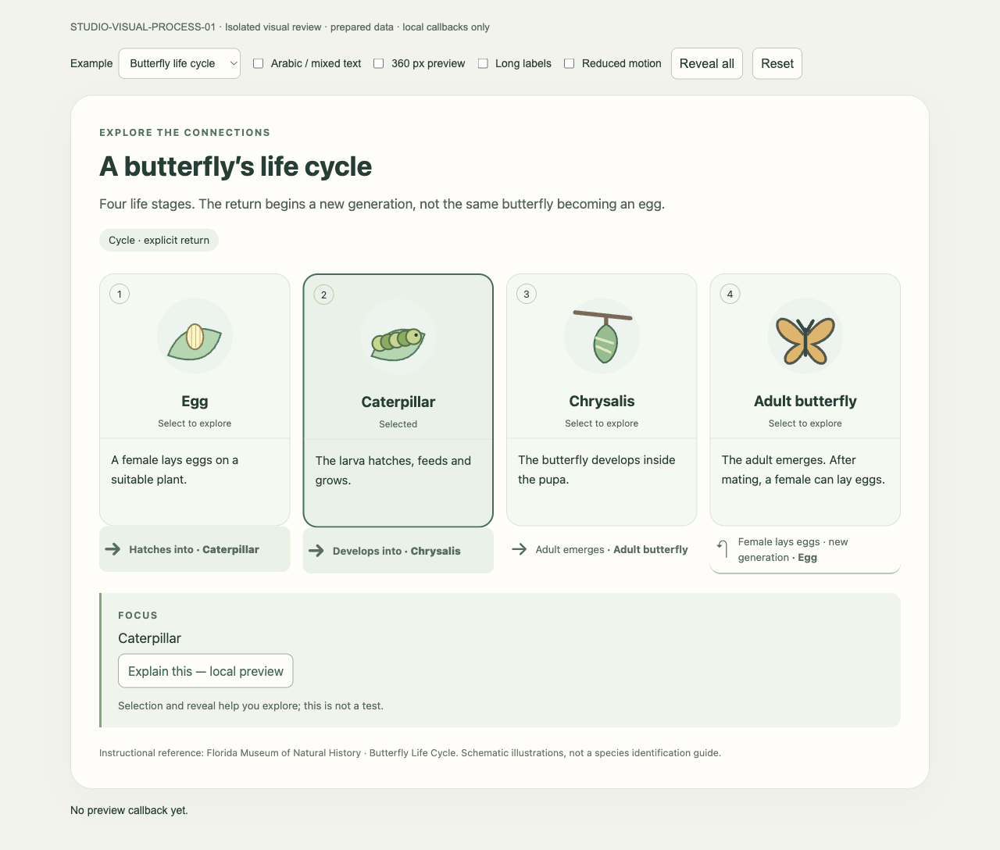
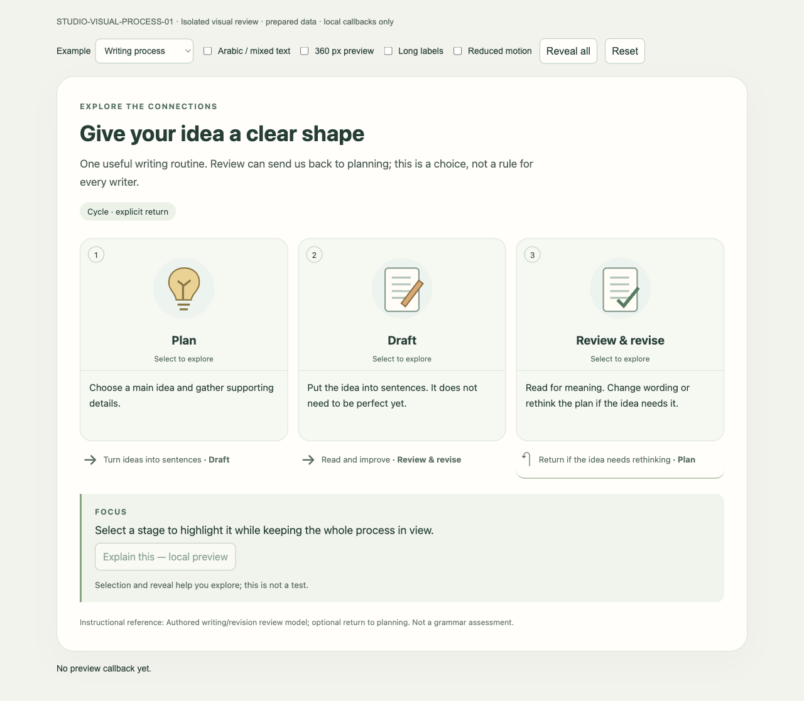
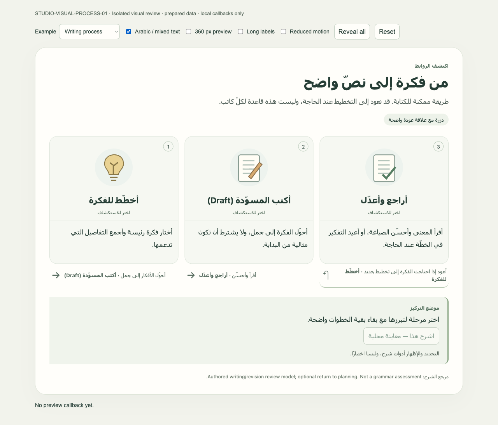
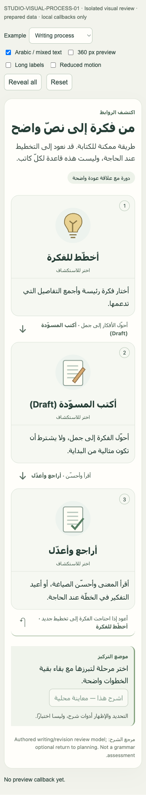
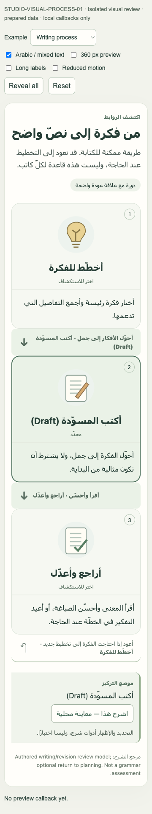
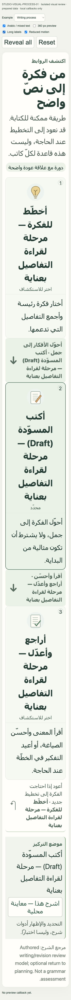

# STUDIO-VISUAL-PROCESS-01 — Early Visual Checkpoint

**Status: EARLY VISUAL CHECKPOINT / PRODUCT OWNER REVIEW. Not DONE. Not ACCEPTED.**

Revision: 2026-09-07. Baseline verified before work and after fetch:
`20b87f05e817b55188302db03e526545d6965b72`, `codex/ctx-03`.
The Product Owner directly accepted the reviewed STUDIO-VISUAL-01 hybrid design
as implementation direction and authorized this frontend-only checkpoint.
Decision 36 records that acceptance; the published design text is retained as
the reviewed artifact, not rewritten or republished by this task.

## What is built

One controlled, production-intended `ProcessView` consumes one semantic input
model: 2–8 stages, stable IDs, labels, descriptions, allowlisted illustration
handles and explicit directed relations. It supports a sequence or a cycle with
an explicit last-to-first relation. No lesson-specific React components exist.
The same component renders all three datasets in English and Arabic.

Selection highlights the stage and adjacent relations; other content stays
legible. Details reveal individually or together. Labels stay available for
orientation. Native buttons support Tab/Enter/Space; Up/Down/Home/End move focus
between stages. Selected state has a border, label and `aria-pressed`, not color
alone. Relationship text names the destination and provides the text equivalent.
The visible Explain control invokes only the harness callback with a stage ID.
No request goes to Tutor, Gateway or an API.

The isolated loopback review entry uses the same component source, compiled with
existing TypeScript and Next's bundled webpack, in production React mode. It is
served as a standalone local review page rather than passing through the Clerk
middleware/layout. No auth bypass or Student-route change was made. The harness
switches example, language, narrow container, long labels and reduced motion.
Its CSP disables all network connections (`connect-src 'none'`); resources are
local. This is a review mount, not a newly integrated Renderer Host route.

## Fixtures and factual review

- **Science sequence:** suspended sand/water mixture → filter → collected water.
  Authored schematic of size-based filtration, with an explicit warning that
  clearer water is not necessarily safe to drink. The general filtration
  principle was checked against [ACS, Water Filtration](https://pubs.acs.org/doi/10.1021/ed081p224A).
  It is not a replication of that article's multi-layer apparatus or a practical
  drinking-water instruction, and does not change the accepted ordering activity.
- **Science life cycle:** egg → caterpillar → chrysalis → adult; a female laying
  eggs begins the next generation. Stages and reproduction were checked against
  [Florida Museum, Butterfly Life Cycle](https://www.floridamuseum.ufl.edu/educators/resource/butterfly-life-cycle/).
  The same individual is never described as returning to an egg. Illustrations
  are schematic and do not identify a species.
- **Language:** plan → draft → review/revise, with an explicitly optional return
  to planning if the idea needs rethinking. This is an authored instructional
  routine, not a universal writing rule or grammar assessment. Arabic includes
  the isolated-context English term “Draft”. Stage order remains explicit and
  is not automatically mirrored by the surrounding RTL text.

All fixtures are prepared review data, not curriculum authority, shared
production content or proof of natural model generation. Small SVG primitives
were authored in application source; no external artwork, asset pack or image
provider was used. Key labels remain DOM text.

## Motion and reuse decision

**Motion deferred; no dependency or lockfile changes.** The installed manifest
has React/DOM but no Motion. The existing frontend guidance permits purposeful
CSS transitions. A finite 180 ms background/border transition and restrained
reveal-opacity transition cover the exact checkpoint behavior without an
additional animation runtime. Text remains readable during reveal. OS reduced
motion and the preview override remove both transitions/animations immediately.
No looping, drag, grading, frame events or durable Studio events exist here.

## Focused verification

| Check | Result and limits |
|---|---|
| New strict model/render checks | 6/6 passed: parser fields/types/limits, 2–8 bounds, malformed topology/relations, duplicate IDs, unknown endpoint, selected/revealed state, all fixtures, Arabic/English, static CSS/fallback |
| Existing Studio web tests | 40/40 passed; compiled `apps/web/lib/studio/*.ts` and ran its Node test files |
| Web typecheck | `npm run typecheck` passed on final source |
| Production build | `npm run build` passed; existing app routes unchanged |
| Exact isolated preview build | `node scripts/build_process_visual_preview.cjs` passed; same view source, production-mode React bundle, no package install |
| Chromium browser matrix | 16/16 checks passed; pointer selection, local callback, keyboard/focus, cycle descriptions/return, RTL and fixed causal order, 360 px viewport/container overflow and arrow direction, OS/preview reduced motion, 200% text plus long labels, no clipped labels, emulated touchscreen tap |
| Whitespace / publication | Checked before staging; only report, selected screenshots and four governance/index paths eligible |

The 200% check doubles the root font size, not browser page scaling. Touch is
Chromium touchscreen emulation, not physical-device evidence. Screenshots are
actual browser output, captured after finite transitions settle. No recording
is claimed. Browser evidence is local visual/protocol proof only; it does not
prove authenticated Studio integration, persistence, learning benefit or live
composition. An initial missing-favicon request was eliminated in the final
isolated harness.

## Visual self-review

The restrained green/cream palette, numbered stages and task-owned illustrations
make the examples distinguishable without a workflow-editor toolbar. Final
screenshots show readable stage labels and meaningful named arrows. The first
review exposed low-opacity reveal text and undersized Arabic body text; both
were corrected and the gallery recaptured. Narrow arrows point down, desktop
arrows point along the fixed sequence; the return is explicitly labeled.

The layout deliberately remains a row/stack of illustrated stages with a named
return, rather than a spatial circular drawing. It retains some card-based
structure; Product Owner judgment on that visual language is still required.
The cycle is not inferred from geometry. Narrow views scroll vertically to
preserve label size; 200% long-label content is tall. No key-label clipping or
horizontal overflow was found in the tested cases. Arabic shaping and mixed
text were inspected after switching to the system font stack. Cross-platform
font differences and physical-device/screen-reader review remain unverified.

## Gallery

### Science sequence — initial

### Science sequence — selected / relation emphasis / local callback

### Life cycle — partially revealed

### Life cycle — fully revealed

### Language example — English

### Language example — Arabic / mixed text

### 360 px Arabic view

### Reduced-motion static selection

### 200% text / long labels / 360 px

## Local implementation held for review

All six source/test/helper files below remain **uncommitted and unstaged**.
Illustration primitives and styles live inside the view; there are no separate
asset or dependency modifications. SHA-256 identifies the source actually used
for this gallery, without publishing implementation source.

| Local path | SHA-256 |
|---|---|
| `apps/web/components/studio/visual-explanation/process-model.ts` | `ee5813627998c85a8aef8182529574583246c52eb782fb12536894372b028b93` |
| `apps/web/components/studio/visual-explanation/process-model.test.cjs` | `d72956945b1b37cb173814dba4052136f0469e73dc079428e7e0e69a0877713a` |
| `apps/web/components/studio/visual-explanation/process-view.tsx` | `fe3cc532ed4015173a520aa2706abe6121c52072d084901a3a5d7c47bddc8218` |
| `apps/web/components/studio/visual-explanation/process-review-data.ts` | `d47d05eb5fc3d87851a7abf5ec119f4e85a68d59ec7da64405a203c104da90b0` |
| `apps/web/components/studio/visual-explanation/process-review.tsx` | `9f45c8f501a33133dd833474ba9d75df91a598c378dfd47238764978f365d0f1` |
| `scripts/build_process_visual_preview.cjs` | `adda7511cac2b339346a91efebd8ad53e963c71524c08ceea96b9b30f4d63a20` |

To rebuild locally, run `node scripts/build_process_visual_preview.cjs` from the
worktree, then serve `output/playwright/studio-visual-process-01/site` on loopback
with a static server. No account or API is needed. Compiled output and local
browser/check logs remain in that task evidence directory and are not published.

## Publication boundary and next action

The only published changes are this report, its nine selected PNG previews,
`docs/reviews/README.md`, `docs/DAILY_USE_RELEASE_DECISIONS.md`,
`project-state/DAILY_USE_RELEASE_TASKS.md` and `project-state/PROJECT_STATE.md`.
The previous 847 untracked files remain protected. No implementation source,
raw private evidence, dependency, environment or generated bundle is staged.
Final delivery provides the actual commit SHA and remote parity.

Await Product Owner visual review before any source commit or further work.
No Canvas specialist, model-generated scene, DB persistence, real Tutor call,
production Student traffic, migration, account change or runtime activation.
Full STUDIO-VISUAL-PROCESS-01 acceptance, other patterns and all remaining
fractions/division/Voice/Vision work retain their separate gates.
