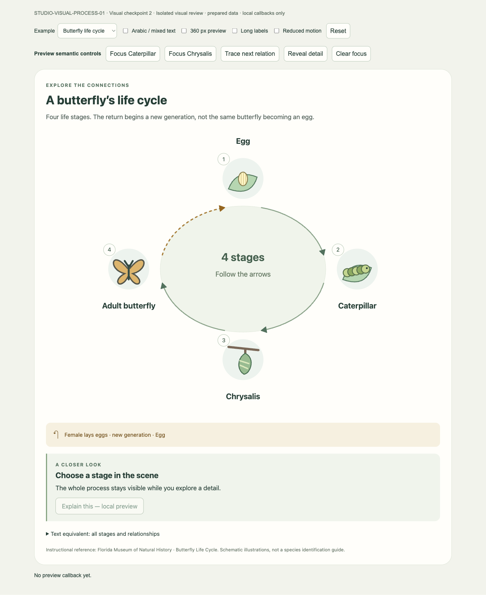
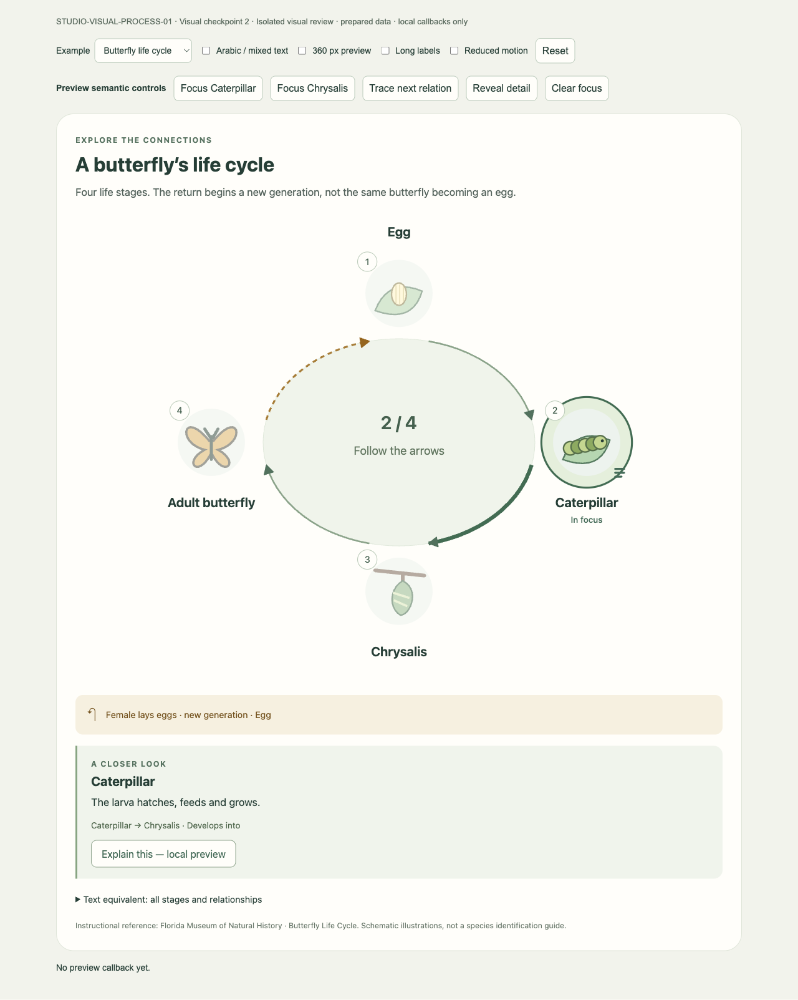
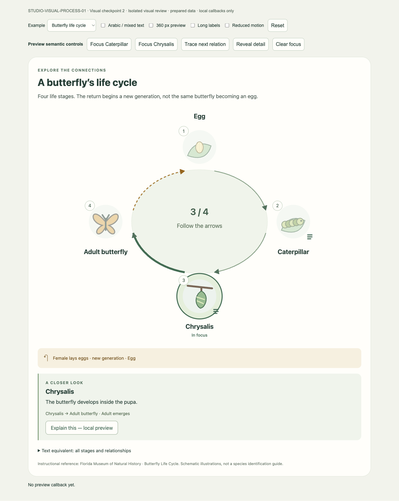
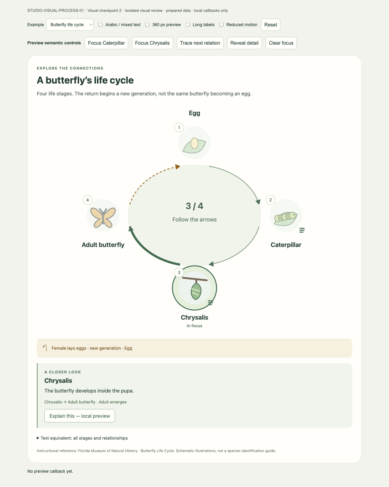
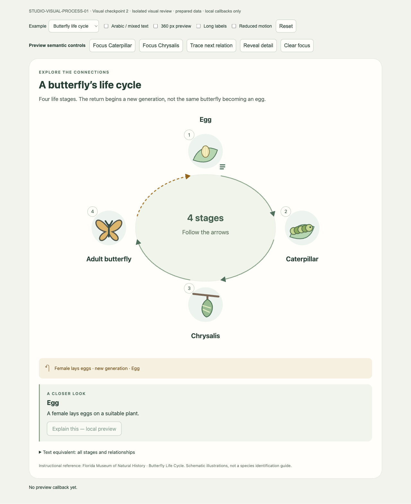
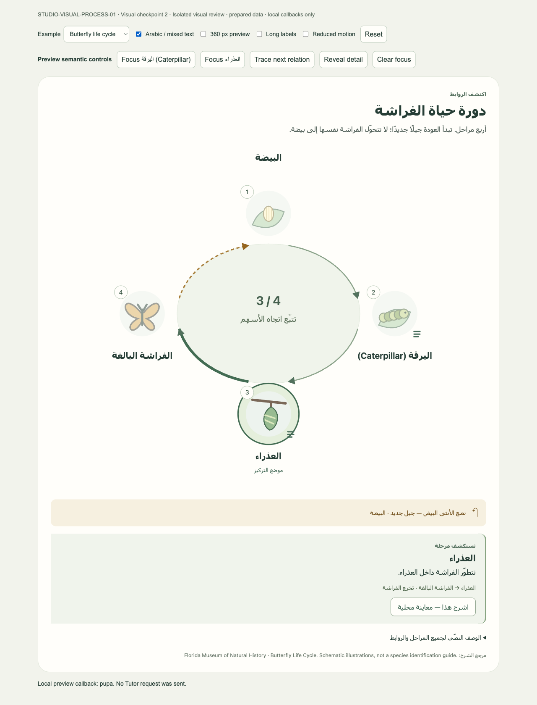
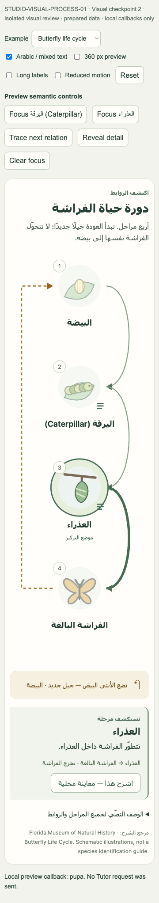
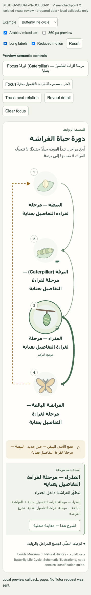
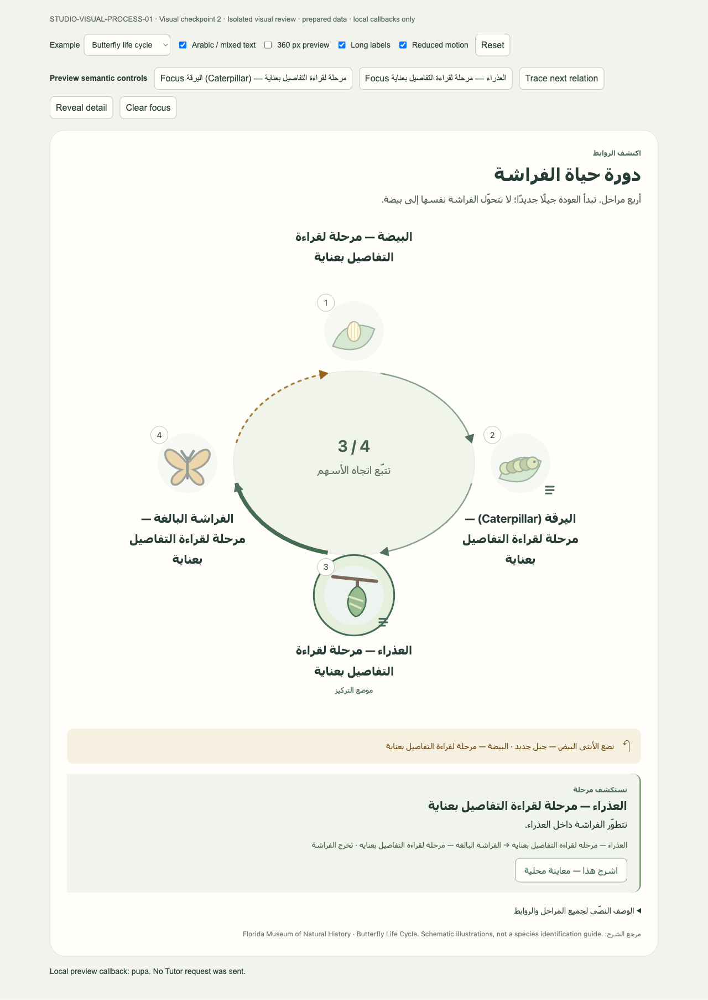

# STUDIO-VISUAL-PROCESS-01 — Visual Checkpoint 2

**Status: VISUAL CHECKPOINT 2 / PRODUCT OWNER REVIEW. Not DONE. Not ACCEPTED.**
Revision: 2026-09-07. Baseline: `fc65cef4ff20184ce1a37ef2b87443c2e0ec4711`, branch `codex/ctx-03`.

## Review decision and scope

The same semantic Process model now drives a spatial SVG cycle, focus transitions,
relation tracing and progressive detail. This answers the bounded visual question
with prepared butterfly data; it does not establish model composition quality,
learning benefit or production Studio integration.

Product Owner retained Checkpoint 1's semantic architecture and rejected its
card/row/stack language as the final primary Canvas representation. The six
existing uncommitted files were preserved and evolved, not restarted. Their
starting hashes matched the [Checkpoint 1 manifest](VISUAL_CHECKPOINT.md).
That report and its original gallery remain historical evidence.

One generic ProcessView lays out declared stages and relations. The butterfly
stress case uses the existing task-owned illustration primitives and reviewed
[Florida Museum instructional source](https://www.floridamuseum.ufl.edu/educators/resource/butterfly-life-cycle/).
No new lesson component or biological content was introduced. The dashed return
means a female lays eggs for a **new generation**, not the same individual
becoming an egg. Illustrations are schematic, not species-identification assets.
Existing Science sequence and language fixtures remain in the same harness;
this checkpoint's visual evidence is specifically the four-stage butterfly cycle.

## Semantic state → visual state

| State/action | Application-owned presentation |
|---|---|
| Default / clear | All stages and directed relations visible, no dominant stage; clear resets local view state. |
| `focusedStageId`, `selectedId`, `highlightedStageIds` | Focus ring and explicit focus label; other illustrations soften while their labels stay readable. |
| `highlightedRelationIds` | Declared outgoing path becomes thicker (not color alone); its arrowhead remains visible. |
| `revealedIds` | Small detail indicator; retained revealed state does not remove the surrounding cycle. |
| `activeExplanationStageId` | React/DOM callout displays the existing reviewed detail. Reveal can open a detail without changing focus. |
| `tracingRelationId` | Draw overlay follows only that declared path in its direction; complete base path and arrow remain. |
| Focus Caterpillar → Focus Chrysalis | Same scene and keyed SVG objects remain mounted; focus, outgoing path and explanation change. |
| Click/tap, keyboard, preview focus controls | Same pure `nextViewState` reducer; legacy select and focus have identical semantics. |
| Explain this | Existing local callback receives selected stage ID only; no Tutor request or persisted Event. |

Relations now have explicit stable IDs, validated for uniqueness and references.
The strict authored-preview model retains 2–8 stages, bounded labels/details,
allowlisted illustration kinds and unknown-field rejection. This local contract
change does not change WorkspaceIntent or any production API/schema. Unknown
stage/relation actions cannot target arbitrary content. Structural validation
alone does not certify scientific correctness.

SVG owns positions, stage symbols, curves, arrowheads, rings and trace. Short
application-rendered DOM labels sit in SVG foreignObject; long text and controls
remain DOM. No model-authored executable markup, remote assets or browser code.
Wide cycles use radial placement; below 620 px container width, a vertical
spatial cycle has an explicit last-to-first return path. Layout uses topology,
stage count and label length, not a butterfly-specific component switch. Arabic
text follows RTL while causal stage/path order stays stable.

## Motion decision: DEFER Motion; retain native CSS/SVG

Reevaluation covered the added path drawing, coordinated focus and interruption
needs. Native React state plus CSS/SVG implements this bounded vocabulary without
an animation controller, timeline or second state owner. Motion's declarative
path/transition orchestration is unnecessary for this slice. No package was
adopted or installed; no package/lockfile changed. This is a task-fit decision,
not rejection of Motion for future requirements.

- FOCUS_OBJECT / DEEMPHASIZE_OTHERS / TRANSITION_FOCUS: 220 ms opacity and ring transitions driven by semantic state.
- REVEAL_OBJECT_DETAIL: a short detail appearance transition; text meaning is immediate and persistent.
- TRACE_RELATION: normalized SVG path dash drawing over 900 ms, with no narration timestamps or loop.
- A new focus removes the old trace overlay, including mid-animation; clear removes transient state. Unmount removes animation elements and disconnects the resize observer. Repeating an unchanged trace is idempotent, not a playback timeline.
- Both OS reduced motion and the review override remove transitions/animation and show the complete highlighted path immediately. Focus, direction and details are preserved.

No MOVE_ALONG_RELATION was needed. No bounce, particles, continuous animation,
Motion+, AI Kit or other runtime was added.

## Verification and visual self-review

| Check | Result |
|---|---|
| Focused process tests and isolated production-mode preview build | 12/12 pass; bundle built using installed tooling. |
| Existing Studio web tests | 40/40 pass. |
| Web typecheck | Pass. |
| Web production build | Pass. |
| Focused real-browser matrix | 27/27 pass. |

The browser matrix verifies default radial layout; stable four stage/relation
IDs; Caterpillar then Chrysalis state and DOM identity; outgoing emphasis;
declared path tracing with a measured intermediate dash offset; trace cancellation;
reveal without losing the cycle; pointer/preview/keyboard equivalence; visible
keyboard focus; local callback; Arabic/mixed direction; 360 px layout and explicit
return; OS and preview reduced motion; long-label overflow and separation from
illustrations/return caption; and emulated touch. No physical-device or screen-reader
session was run. No backend/Python test suite was run.

Actual image inspection found long Arabic labels colliding with the next symbol
and return caption. Label-dependent spacing was added and all images/checks rerun.
Arrowheads were strengthened to remain legible on thick highlighted curves.
The final radial layout reads as a cycle, symbols carry the primary representation,
and focused/unfocused objects stay identifiable. The narrow layout preserves the
return rather than shrinking unreadable radial labels. Long mobile content is
intentionally tall; the wide layout has generous whitespace. Product Owner should
judge that balance and illustration scale. The full 2–8-stage structural range is
not a claim that every count, locale or topology has received this visual review.

This is deterministic authored-data/component evidence. There is **no specialist,
no Tutor integration, no DB change, no model-generated scene and no Student traffic**.
No provider, Worker/Gateway, account or production activity was touched. Future
runtime integration, persistence, safety and actual model-quality gates remain open.
Other patterns, fractions/division, Voice/Vision and accepted activities retain their
separate status. The visual language is not accepted until Product Owner reviews it.

## Actual browser gallery

All images are page-only captures from the isolated local React mount, without
learner data, browser chrome or the development pet. Eight required states plus
three useful stress/intermediate captures follow. No recording was produced.
The intermediate image pauses the real CSS animation at 450 ms; it is not a
fabricated frame. Static screenshots alone do not prove timing; browser checks
measure tracing and interruption separately.

### 01-cycle-default

Default desktop: all stages visible, no focus.

### 02-caterpillar-focus

Caterpillar focus and outgoing relation.

### 03-chrysalis-focus

Chrysalis focus after transition, same scene objects.

### 04-relation-traced

Declared relation traced and highlighted.

### 05-detail-reveal

Progressive Egg detail without stage dominance.

### 06-arabic-mixed

Arabic surrounding text with mixed English label.

### 07-narrow-cycle

360 px spatial cycle with explicit new-generation return.

### 08-reduced-motion

OS reduced-motion state: full relation and focus retained.

### 09-trace-intermediate

Actual intermediate relation drawing at 450 ms.

### 10-long-labels-narrow

Long Arabic/mixed labels on narrow layout after spacing fix.

### 11-long-labels-wide

Long Arabic/mixed labels on wide layout after spacing fix.

## Uncommitted implementation inventory and reproduction

Exactly these six implementation/test/helper files remain untracked, unstaged
and uncommitted. Hashes identify the local source used for this gallery; publication
contains no source, package, lockfile or external asset-pack changes.

| Repository-relative path | SHA-256 |
|---|---|
| `apps/web/components/studio/visual-explanation/process-model.ts` | `ef0056f7bb482f31cad34d2d69ccb084fa72400b2d899368b238fd9646d6bc5d` |
| `apps/web/components/studio/visual-explanation/process-model.test.cjs` | `96801c35b01b687cf17252c6e8c5a005708f42b16d5c0b85e8a621520d552fb9` |
| `apps/web/components/studio/visual-explanation/process-view.tsx` | `9d51dec860cb4dc5c0826891abcc43df20e36bd506cf8020a60260afbf3353f6` |
| `apps/web/components/studio/visual-explanation/process-review-data.ts` | `8555290d1a43ea363b4cff10bb06549604ee25e551f2405c7564e3758f8c9e83` |
| `apps/web/components/studio/visual-explanation/process-review.tsx` | `3272b443d5b7243fd147617b462ac99a0bcbc18a66552eed72bd7f66e04eda42` |
| `scripts/build_process_visual_preview.cjs` | `2c9ee582e4cd23baf25a89c9e9f89f548aa2c26396a5785f4ade182037099461` |

From the worktree, `node scripts/build_process_visual_preview.cjs` runs focused
checks and builds the isolated preview using installed dependencies. Serve only
`output/playwright/studio-visual-process-01-v2/site` on loopback for review.
The helper uses production-mode React with standalone bundle minimization disabled;
the application production build is a separate successful check. Its CSP blocks
network connections (`connect-src 'none'`). No account or live app route is needed.
Raw logs and browser-run details remain local under the version-2 output directory;
Checkpoint 1 output and all unrelated tracked/untracked work remain preserved.

Publication allowlist: this report, its eleven `preview-v2` PNGs, the review index,
decision register, current task overlay and Project State. No implementation is
promoted or committed by this review delivery. Stop at Product Owner visual review.
